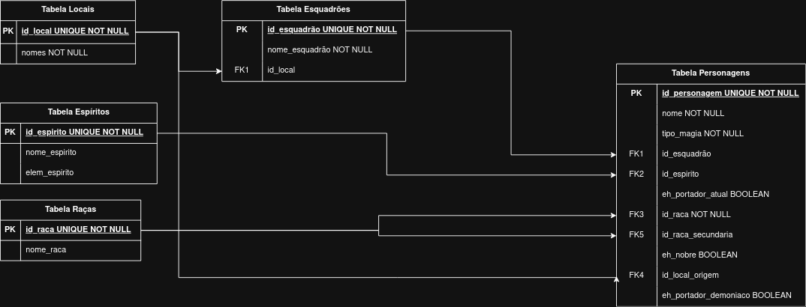

# CRUD Catálogo Black Clover - backend & banco de dados

## Sobre o Projeto
API RESTful construída para gerenciar o catálogo de personagens do universo de Black Clover. Este repositório contém a lógica de back-end
e a modelagem do banco de dados relacional, lidando com chaves estrangeiras complexas (Esquadrões, Locais, Raças e Espíritos).

## Funcionalidades (Features)
* Criação, Leitura, Atualização e Exclusão (CRUD) de personagens.
* Filtros dinâmicos por magia, local de origem e esquadrão.
* Banco de dados normalizado para garantir a consistência das entidades do anime.

## Tecnologias Utilizadas (Tech Stack)
* **Python 3**
* **Flask** (Criação da API e rotas)
* **MySQL** (Banco de Dados Relacional)
* **Aiven** (Hospedagem do Banco de Dados na nuvem)
* **Render** (Hospedagem da API)

## Modelagem do Banco de Dados

*O banco foi projetado levando em consideração regras específicas do universo, como raças secundárias e posse de espíritos elementais.*

## Endpoints da API

| Método | Rota                  | Descrição                        |
|--------|-----------------------|----------------------------------|
| GET    | /personagens          | Lista personagens (aceita filtros)|
| POST   | /personagens          | Cadastra novo personagem         |
| PUT    | /personagens/:id      | Atualiza um personagem           |
| DELETE | /personagens/:id      | Remove um personagem             |

**Filtros disponíveis no GET:**
?nome=&magia=&local=&esquadrao=

## Como rodar o projeto localmente (Setup)
**1. Clone esse repositório**

**2. Abra a pasta do projeto**

**3. Crie e ative o ambiente virtual**

No Linux/Mac:
python3 -m venv venv
source venv/bin/activate

No Windows:
python -m venv venv
venv\Scripts\activate

**4. Instale as dependências**
pip install -r requirements.txt

**5. Configure as Variáveis de Ambiente**
Por questões de segurança, a senha do banco de dados em nuvem não está exposta. Para que a API consiga se conectar ao banco
localmente, você precisa definir a variável de ambiente no seu terminal antes de executar o projeto.

No Linux/Mac:
export DB_PASSWORD="senha_do_banco_aqui"

No Windows (CMD):
set DB_PASSWORD=senha_do_banco_aqui

No Windows (PowerShell):
$env:DB_PASSWORD="senha_do_banco_aqui"

Essa variável vale apenas para a sessão atual do terminal. Se fechar e 
abrir um novo, precisará defini-la novamente antes de rodar o projeto.

**6. Execute a aplicação**
python3 app.py

A API estará rodando em http://127.0.0.1:5000.
